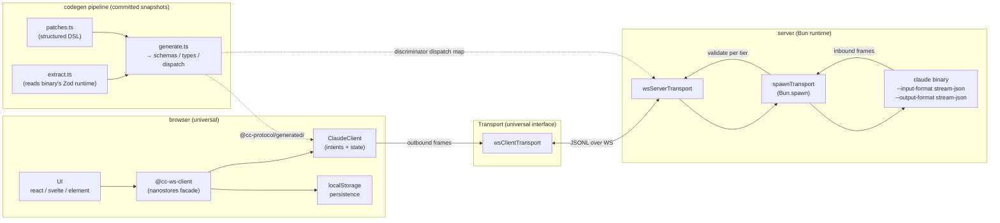
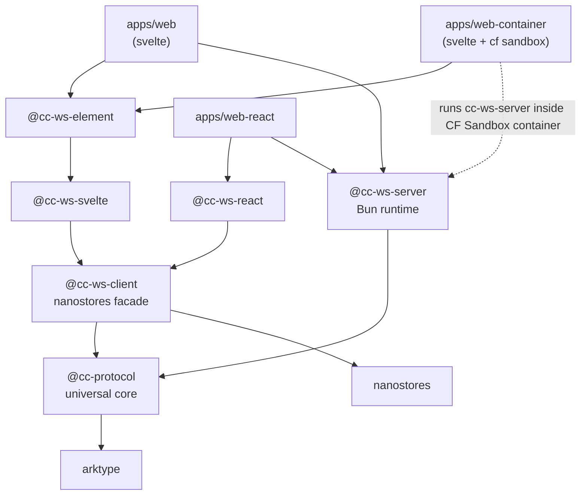
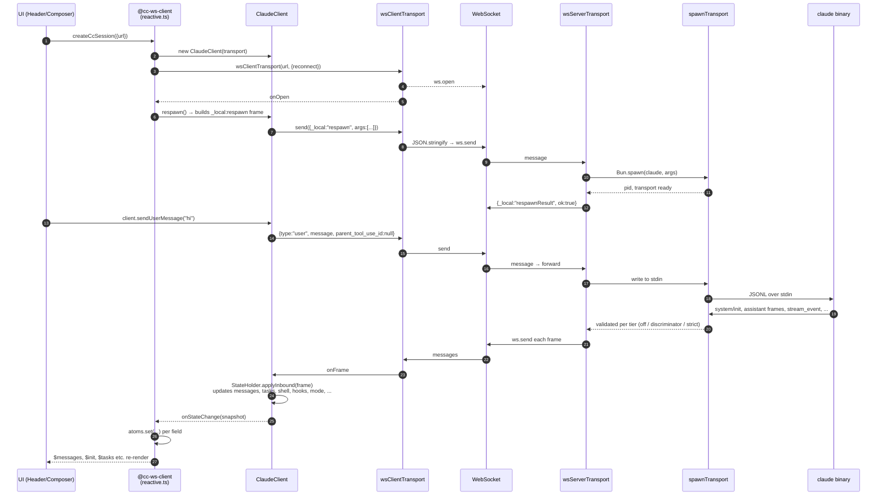
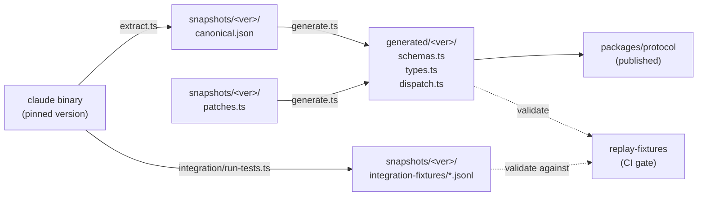

# cc-ws-web

A WebSocket-fronted bridge to the `claude` CLI, plus a typed protocol layer, framework adapters, and a drop-in chat UI. Started as a one-file spike; now a workspace where the wire protocol, the runtime, the reactive client, and the UI ship as separate packages — each with a single, sharp responsibility.

The hard problem the workspace solves: keeping a typed, validated wire-format definition of Claude Code's undocumented stream-json protocol in lock-step with the actual binary, without copying any leaked source. A codegen pipeline extracts the binary's embedded Zod schemas, applies a structured patch DSL for the gaps, and emits arktype runtime schemas + TypeScript types. Integration fixtures captured against a real binary catch behavioural drift; replay tests in CI catch schema regressions. A skill (`.claude/skills/regen-protocol/`) automates the version-bump loop end-to-end.

```sh
bun install

# Pick a reference app:
bun --filter './apps/web' dev            # Svelte + Vite + standalone bridge on :3000
bun --filter './apps/web-react' dev      # React 19 + Bun.serve, single-process
bun --filter './apps/web-container' dev  # Svelte + Vite + bridge inside a Cloudflare Sandbox container (needs Docker)
```

## High-level architecture



## Package matrix

| Package | Role | Browser-safe? |
| --- | --- | --- |
| [`@somewhatintelligent/cc-protocol`](packages/protocol) | Schemas + types + `Transport` interface + `ClaudeClient` + `ClaudeProcess` + universal transports (`buffer`, `inMemoryPair`, `wsClientTransport`). Generated from a pinned Claude binary; no Node/Bun deps in `src/`. | ✅ — zero `Bun.*` / `node:*` references, enforced by grep gate |
| [`@somewhatintelligent/cc-ws-server`](packages/server) | Bun runtime. `Bun.spawn`-using transports (`stdio`, `ws-server`, `spawn`), plus the WebSocket bridge that pumps frames between a client and a child `claude` process. | ❌ — Bun runtime only |
| [`@somewhatintelligent/cc-ws-client`](packages/client) | Thin nanostores facade over `ClaudeClient`. Preserves the `CcAtoms` contract downstream packages expect; adds localStorage persistence. | ✅ |
| [`@somewhatintelligent/cc-ws-react`](packages/react) | `useCcSession` hook (re-export of nanostores `useStore` over the atoms). | ✅ |
| [`@somewhatintelligent/cc-ws-svelte`](packages/svelte) | Typed context injection over the atoms (which already satisfy Svelte's store contract). | ✅ |
| [`@somewhatintelligent/cc-ws-element`](packages/element) | `<cc-ws-chat>` custom element. Shadow-DOM-isolated; drop-in for any framework. | ✅ |

### Apps

| App | Stack | Notes |
| --- | --- | --- |
| [`apps/web`](apps/web) | Svelte 5 + Vite | Mounts `<cc-ws-chat>` from `packages/element`. Runs the bridge concurrently via `bun --hot ../../packages/server/src/server.ts`. |
| [`apps/web-react`](apps/web-react) | React 19 + `Bun.serve` | Single-process app: Bun serves HTML + bundled `client.tsx` and hosts the bridge at `/ws`. |
| [`apps/web-container`](apps/web-container) | Svelte 5 + Vite + `@cloudflare/sandbox` | Bridge runs inside a per-session Cloudflare Sandbox container; worker proxies WS via `wsConnect`. Mirrors slopbox's container substrate (per-session credential injection, GitHub PAT-as-outbound-proxy, idempotent `/init`) without auth / D1 / dashboards. |

### Package dependency graph



## End-to-end frame flow

User types a message in the Svelte UI; here's what happens on the wire:



## Supported features

### Wire protocol

- Schemas + types pinned to a specific `@anthropic-ai/claude-code` binary version (`codegen/version.ts:ACTIVE_VERSION`).
- Mechanical regeneration from the binary's embedded Zod schemas — see `codegen/extract.ts`.
- Structured patch DSL for fields the structural extractor can't auto-resolve (`codegen/patch-dsl.ts`).
- Discriminator-keyed dispatch map for O(1) validation lookup.
- Three runtime validation tiers (`off` / `discriminator` / `strict`) selectable per `ClaudeProcess`.
- Browser-safety enforced structurally: `@cc-protocol/src/` has zero `Bun.*` / `node:*` references (CI grep gate).

### Client-side state aggregation (in `@cc-protocol/client`)

- **Messages** — streaming-bubble assembly from `stream_event` (`message_start` → `content_block_start/_delta/_stop` → `message_stop`).
- **Tasks** — full lifecycle from `system/task_started` → `task_progress` → `task_notification` / `task_updated`, with sub-agent task routing via `parent_tool_use_id`.
- **Shell entries** — `system/local_command_output` aggregation with rolling output and stop-detection.
- **Hook events** — `hook_started` → `hook_progress` → `hook_response` chains.
- **Pending permissions** — UI-shape queue from `can_use_tool` control_requests; consumers respond via `client.respondToPermission(id, decision)`.
- **Mode tracking** — `set_permission_mode` round-trip with `activeMode` / `pendingMode` / `modeError`.
- **Model tracking** — `set_model` round-trip with `activeModel` / `pendingModel` / `modelError`.
- **Session lifecycle** — start (`initialize`), end (`end_session`), respawn (caller-managed instance disposal + recreation with a fresh transport).

### Transports (`Transport = { send, onFrame, close, closed }`)

- `bufferTransport` — pure in-memory; tests script wire traffic with `feed()` / `drain()`.
- `inMemoryPair` — returns `[a, b]` where `a.send → b.onFrame` and vice versa; enables `ClaudeClient ↔ ClaudeProcess` E2E tests with zero IO.
- `wsClientTransport(url, opts?)` — universal WebSocket client; opt-in exponential-backoff reconnect.
- `stdioTransport` — JSONL framing over arbitrary streams (in `@cc-ws-server`).
- `wsServerTransport` — Bun `ServerWebSocket` adapter (in `@cc-ws-server`).
- `spawnTransport` — `Bun.spawn`s `claude` with canonical args; returns `Transport & { pid, exited, kill }` (in `@cc-ws-server`).

### Codegen pipeline (`codegen/`)

- **Extractor** anchors on Zod-method shape, not lazy-wrapper aliases — survives bundler renames across binary versions (verified across `xH/v → CH/y` between 2.1.129 and 2.1.139). Auto-detects multiple Zod namespaces. Captures per-field RHS expression strings for type translation.
- **Patch DSL** (`fieldType` / `addField` / `removeField` / `renameSchema` / `resolveAnon` / `discriminantHint`) — every patch carries a `reason` for audit trail.
- **Generator** emits `schemas.ts` (arktype) + `types.ts` (`typeof X.infer`) + `dispatch.ts` (discriminator map). All carry `@generated` headers and `/* @__PURE__ */` annotations for tree-shaking.
- **Integration test harness** drives the binary through a zero-cost test catalog (only side-effect-free control requests); captures fixtures as committed `.jsonl` files.
- **Replay-fixtures** validates committed fixtures against committed schemas — runs in CI without needing the binary.
- **Drift detection** via `extract.ts compare` between snapshots; produces a markdown diff committed under `codegen/snapshots/drift/`.
- **Coverage tracking** — `coverage.json` per snapshot records `{ typed, partial, unknown }` field counts.
- **Failure log** — append-only `failures.md` per snapshot records every `unknown`-fallthrough and validation rejection, with `reason` / `attempted-fix` / `resolution`.
- **One-command checkpoint** — `bun codegen/checkpoint.ts` runs all 14 gates in sequence with a coloured pass/fail table.

### Skill — `regen-protocol`

`.claude/skills/regen-protocol/SKILL.md` encodes the version-bump workflow as a 13-step procedure. Triggers: "bump claude protocol", "regen claude schemas", "claude binary updated". Walks: extract → diff → seed patches → codegen → integration capture → checkpoint → changeset.

## Codegen pipeline at a glance



## Dev workflow

```sh
# Svelte reference (Vite + bridge concurrently)
bun --filter './apps/web' dev

# React reference (Bun serves HTML + bridge from one process)
bun --filter './apps/web-react' dev

# Cloudflare Sandbox container reference (Svelte + bridge inside a CF Sandbox)
bun --filter './apps/web-container' dev    # needs Docker (or OrbStack / Colima)

# Build the <cc-ws-chat> embed bundle
bun --filter '@somewhatintelligent/cc-ws-element' build

# All-packages tests
bun test

# Per-package typechecks
bunx tsc --noEmit -p packages/protocol/tsconfig.json
bunx tsc --noEmit -p packages/server/tsconfig.json

# Codegen checkpoint (extractor + codegen + integration + replay + verify-package)
bun codegen/checkpoint.ts

# Live binary E2E (opt-in)
CC_PROTOCOL_LIVE_BINARY=1 bun test packages/server/__tests__/live.test.ts
```

## Bumping the Claude binary version

Invoke the **`regen-protocol`** skill (`.claude/skills/regen-protocol/SKILL.md`). It runs:

1. Branch + clean state check.
2. `claude --version` vs `ACTIVE_VERSION`.
3. New extraction.
4. Drift report against the previous snapshot.
5. Patch seed (copy forward).
6. Codegen + coverage report.
7. Patch-authoring loop with the user / AI (the leaked source at `../claude-code/src/entrypoints/sdk/` is consulted for *shape only*; no source ever copied).
8. Integration fixture capture against the new binary.
9. Loop steps 6–8 until clean.
10. `bun codegen/checkpoint.ts` — all gates green.
11. `bun changeset` — semver per drift severity.
12. `bun codegen/verify-package.ts` — pre-publish guard.
13. Hand-off summary.

See [`codegen/README.md`](codegen/README.md) for the pipeline mechanics.

## Limitations

- Designed for local dev / sandboxed deployment. The bridge has no auth — put it behind something (Cloudflare Sandbox container, an authenticated proxy, an SSO mesh) before exposing it.
- One WS connection = one `claude` child = one session.
- Relies on the host already being OAuth-authed at `~/.claude/.credentials.json` (or `ANTHROPIC_API_KEY` set).
- Schemas pinned to one binary version at a time; consumers run against any binary version but type-level guarantees only hold against the pinned one.

## Provenance

The schemas in `packages/protocol/generated/` are *derived from observation of a Claude binary you legally installed* — they're the output of extracting embedded Zod runtime values from the bundled JS inside the standalone executable. No leaked source is copied into this repo. The leaked Claude Code source (when used at all, during patch authoring) is consulted as a reading reference for *structural shape only*, and each patch carries a `reason` field naming the file:line it was derived from. See `codegen/README.md` for details.
