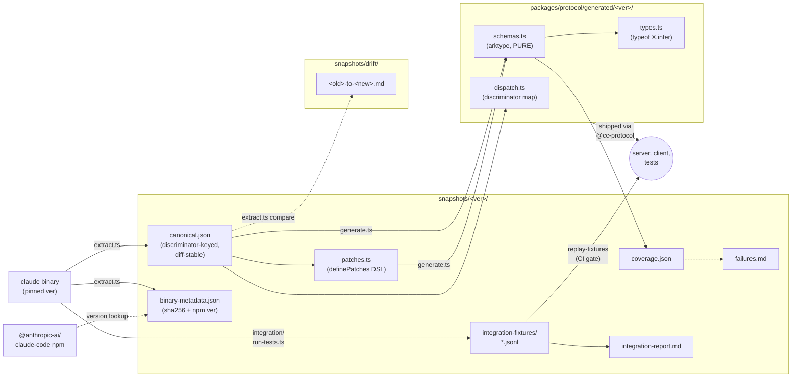
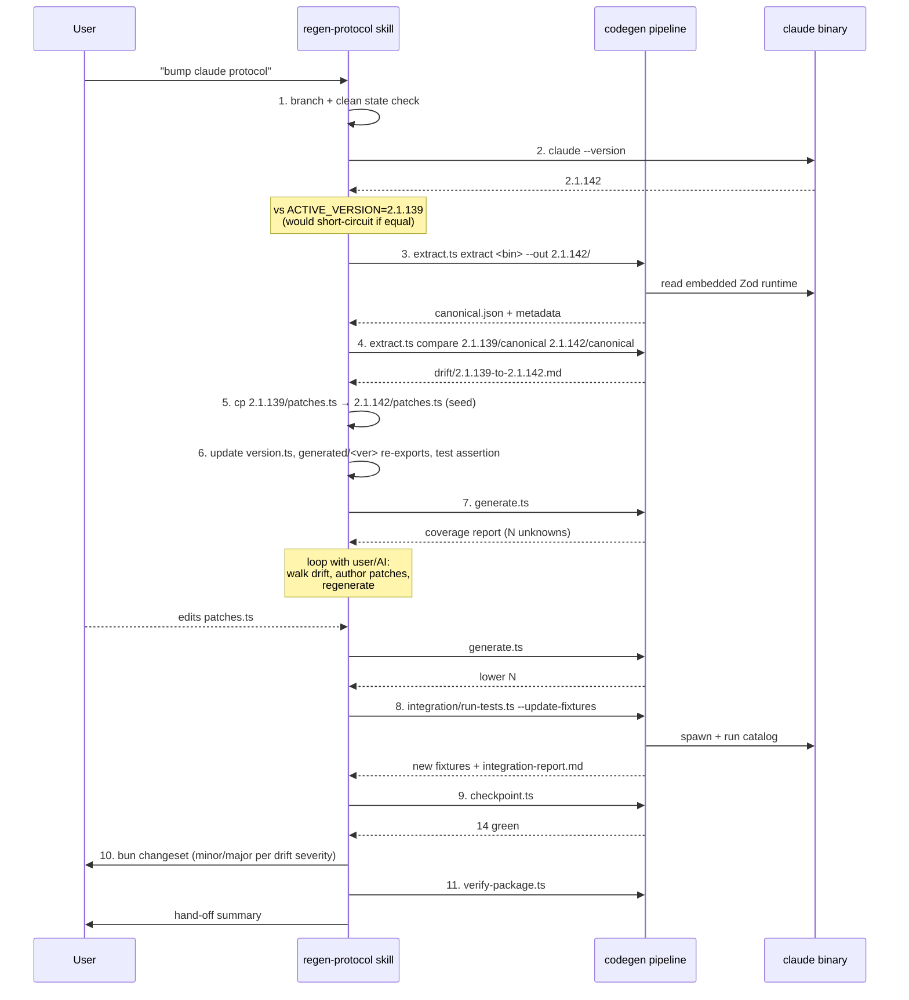

# codegen — Claude Code stream-json protocol pipeline

## What this is

`codegen/` is the authoritative pipeline that keeps the typed
wire-format definitions for the Claude Code `--input-format stream-json
--output-format stream-json` channel in sync with the actual binary.
The Anthropic binary is the source of truth; the extractor reads its
embedded Zod schemas, a structured patch DSL fills the gaps the
structural extractor can't auto-resolve, and codegen emits arktype
runtime schemas + TypeScript types under
`packages/protocol/generated/<version>/`. Every artifact committed
under `snapshots/<version>/` is reproducible from the matching binary
at the recorded sha256 — no leaked source required.

## Pipeline at a glance



## Layout

```
codegen/
├── README.md                          # this file
├── version.ts                         # ACTIVE_VERSION, ACTIVE_BINARY_SHA256, ACTIVE_NPM_PACKAGE_VERSION
├── extract.ts                         # binary → canonical.json (+ supporting artifacts)
├── apply-patches.ts                   # pure resolver: canonical + patches → annotated canonical
├── generate.ts                        # annotated → schemas.ts / types.ts / dispatch.ts
├── check-gaps.ts                      # canonical vs a TS target file — report missing/stale literals
├── verify-package.ts                  # prepublish guard — 8 structural checks
├── checkpoint.ts                      # one-command gate runner (14 gates)
├── ci-checks.ts                       # CI entrypoint (check-gaps + verify-package + replay-fixtures + tsc)
├── patch-dsl.ts                       # Patch union + definePatches() helper
├── integration/
│   ├── stdio-harness.ts               # Bun.spawn wrapper with JSONL framing + idle timeout
│   ├── tests.ts                       # zero-cost catalog (14 tests)
│   ├── run-tests.ts                   # live-binary runner; --update-fixtures
│   └── replay-fixtures.ts             # CI-runnable schema regression
└── snapshots/
    ├── 2.1.137/
    │   ├── canonical.json             # committed
    │   ├── patches.ts                 # committed (seed)
    │   ├── binary-metadata.json       # committed
    │   ├── integration-fixtures/      # committed — *.jsonl per test
    │   ├── integration-report.md      # committed
    │   ├── failures.md                # committed (append-only)
    │   ├── coverage.json              # committed
    │   ├── schemas.json               # gitignored — single-version analysis
    │   ├── unions.json                # gitignored — union resolution dump
    │   ├── report.md                  # gitignored — human-readable summary
    │   └── raw.js                     # gitignored — one schema body per line
    ├── 2.1.139/                       # same shape (the active version)
    └── drift/
        └── 2.1.137-to-2.1.139.md      # cross-version diff (committed in full)
```

## Commands

```sh
# Extract every Zod schema from a Claude binary into a snapshot dir.
bun codegen/extract.ts extract <binary> --out codegen/snapshots/<version>

# Diff two canonical snapshots into a markdown drift report.
bun codegen/extract.ts compare \
  codegen/snapshots/<from>/canonical.json \
  codegen/snapshots/<to>/canonical.json \
  --out codegen/snapshots/drift
# (then rename the emitted diff.md → <from>-to-<to>.md)

# Generate arktype schemas + TS types + dispatch map.
bun codegen/generate.ts

# Verify a target TypeScript file covers every binary-emitted discriminator.
bun codegen/check-gaps.ts \
  codegen/snapshots/<version>/canonical.json \
  packages/protocol/generated/<version>/types.ts

# Run the live-binary integration catalog (captures fixtures with --update-fixtures).
bun codegen/integration/run-tests.ts [--update-fixtures] [--only <name>]

# Replay committed fixtures through the active schemas (CI-runnable, no binary).
bun codegen/integration/replay-fixtures.ts

# Run all 14 checkpoint gates in sequence with a coloured pass/fail table.
bun codegen/checkpoint.ts

# CI-only entrypoint — runs only the gates that don't need a live binary.
bun codegen/ci-checks.ts
```

## Per-snapshot artifacts

| File | Committed? | What it is |
|---|---|---|
| `canonical.json` | yes | Discriminator-keyed snapshot of every extractable Zod schema in the binary. Stable across builds — minified-id refs are mangled out, body shapes are hashed. The diff anchor. Never hand-edited; regenerated by `extract.ts`. |
| `patches.ts` | yes | Human/AI overrides via the `definePatches()` DSL. Each patch carries a `reason` string for audit-trail provenance. Authored when `generate.ts` can't auto-resolve a field type, when an anonymous helper needs a name, or when a previously-`unknown` field gets typed. |
| `binary-metadata.json` | yes | `{ binary, binarySha256, binarySize, npmPackageVersion, extractedAt }`. Reproducibility anchor — tie an npm `@anthropic-ai/claude-code` release to a snapshot, detect tampered binaries. |
| `coverage.json` | yes | Per-snapshot coverage metrics: `{ totalFields, typed, partial, unknown }` plus extractor stats (`uniqueZodAliases`, `uniqueLazyWrapperAliases`, `boundToNamedIdent`, `anonymousInline`). Re-runs that show a sharp drop in any number log a loud warning. |
| `integration-fixtures/<test>.jsonl` | yes | Real wire frames captured from a live binary exercise — one JSON object per line, plus a `_meta` header line with test name, binary version, capture timestamp, and the input action sequence used. Replay validation in CI without needing the binary. |
| `integration-report.md` | yes | Human-readable last-run results: which tests passed, which schemas validated against which fixtures, which subtypes are still un-exercised. |
| `failures.md` | yes | Append-only log: every time `generate.ts` left a field `unknown`, a fixture frame failed schema validation, or the binary returned a frame our canonical didn't predict. Each entry carries `reason`, `attempted-fix`, `resolution`. |
| `schemas.json` | no | Single-version analysis — every schema keyed by minified id, with kind, discriminants, xrefs, body, fields. Useful for grep / inspection; gitignored because it's huge and bound to the build. |
| `unions.json` | no | Every resolved `<zod>.union([...])` with its member ids + discriminants. Cross-reference for hand-authoring patches that need to enumerate union members. |
| `report.md` | no | Human-readable summary: counts, discriminators, kind breakdown. Glanceable; not authoritative. |
| `raw.js` | no | One schema body per line, prefixed by its binding name (or `<anon>`). Grep target — find every site that references a given helper, find unusual body shapes, etc. |

## The patch DSL

```ts
// codegen/snapshots/<ver>/patches.ts
import { definePatches } from "../../patch-dsl";

export default definePatches({
  version: "2.1.139",
  patches: [
    {
      kind: "fieldType",
      schema: "SDKControlSetPermissionModeRequest",
      field: "mode",
      arktype: "PermissionMode",
      reason: "binary's bqH() = PermissionModeSchema; xref'd via controlSchemas.ts:482",
    },
    {
      kind: "resolveAnon",
      canonicalKey: "anon/3b8c2be19a7835b5",
      name: "AgentDefinition",
      reason: "fields match coreSchemas.ts:1110–1183 (AgentDefinitionSchema)",
    },
    // ...
  ],
});
```

Patch kinds:

| Kind | What it does |
|---|---|
| `fieldType` | Override a single field's arktype expression (replaces `unknown`). |
| `addField` | Insert a field the extractor missed (e.g. nested helper not surfaced). |
| `removeField` | Drop a field that's binary-internal. |
| `renameSchema` | Rewrite the inferred name in the name map. |
| `resolveAnon` | Assign a name to an anonymous-bucket canonical entry (keyed by canonical key like `anon/<hash>`). |
| `discriminantHint` | Declare missing discriminant info for a schema. |

Every patch carries `reason: string` — the audit trail. Apply order is
deterministic. `apply-patches.ts` throws with a clear error if any
patch references a schema name or canonical key that doesn't exist in
the canonical — TypeScript catches typos at edit time.

## Checkpoint gates

`bun codegen/checkpoint.ts` runs these in sequence:

1. **extractor reproducibility** — extract against the same binary again; canonical.json must be byte-identical.
2. **generate.ts idempotence** — codegen output must be byte-identical to the committed copies.
3. **check-gaps.ts** — every binary discriminator literal appears in `types.ts`.
4. **integration tests (live)** — run the catalog against the local binary; every frame validates.
5. **replay-fixtures** — committed fixtures validate against committed schemas.
6. **bun test (protocol)** — universal tests.
7. **bun publish --dry-run** — prepublish gate (skipped if no registry auth).
8. **verify-package.ts** — 8 structural checks.
9. **simulated-drift smoke** — three injected drifts (mutated fixture, phantom subtype, unknown-threshold breach) must trip three distinct gates with clear messages.
10. **outside-island diff is empty** — confirms phase invariants.
11. **bun test (server)** — runtime-transport tests.
12. **browser-safety grep** — `packages/protocol/src/` has zero `Bun.*` / `node:*` references.
13. **server isolation check** — `packages/server/src/server.ts` + `packages/client/src/` haven't drifted from the phase boundary.
14. **packages/server tsc** + **packages/protocol tsc** clean.
15. **live-binary E2E (opt-in)** — `CC_PROTOCOL_LIVE_BINARY=1 bun test packages/server/__tests__/live.test.ts`.

Phase-2 / phase-3 commits land green at every step; future binary bumps
must hold the line.

## Bump workflow



The full procedure lives in
[`.claude/skills/regen-protocol/SKILL.md`](../.claude/skills/regen-protocol/SKILL.md)
— invoke when the user says "bump claude protocol", "regen claude
schemas", or "claude binary updated".

## The extractor's resilience trick

The Claude binary is `bun build --compile`'d — its JS bundle is
embedded in the executable uncompressed. Schemas are emitted as
`<id>=<lazyWrapper>(()=><zodNs>.<kind>(...))` where `<lazyWrapper>` and
`<zodNs>` are minified per-build and change every release.

`extract.ts` doesn't anchor on the wrapper name. Instead, it scans for
the structurally-meaningful Zod method calls (`object`, `union`,
`discriminatedUnion`, `enum`, `strictObject`, `looseObject`, ...) and
walks back to find the binding context. This handles:

- Lazy-wrapped form: `<id>=CH(()=>y.object(...))` (v2.1.139)
- Lazy-wrapped form: `<id>=xH(()=>v.object(...))` (v2.1.129) — different aliases, same shape
- Bare form: `<id>=y.object(...)` (no wrapper) — V1 limit lifted
- Multiple Zod namespaces in one binary: `y.object`, `fK.enum`, `l6.array` all union into one alternation

Coverage summary on every run reports the detected aliases and the
named/anonymous counts — a sharp drop on a bump triggers a warning.

## Future work

A weekly cron job on a self-hosted runner that installs
`@anthropic-ai/claude-code@latest`, runs `extract`, and opens an issue
if `compare` produces any diff against the pinned version. Surfaces
upstream drift before a manual bump.
