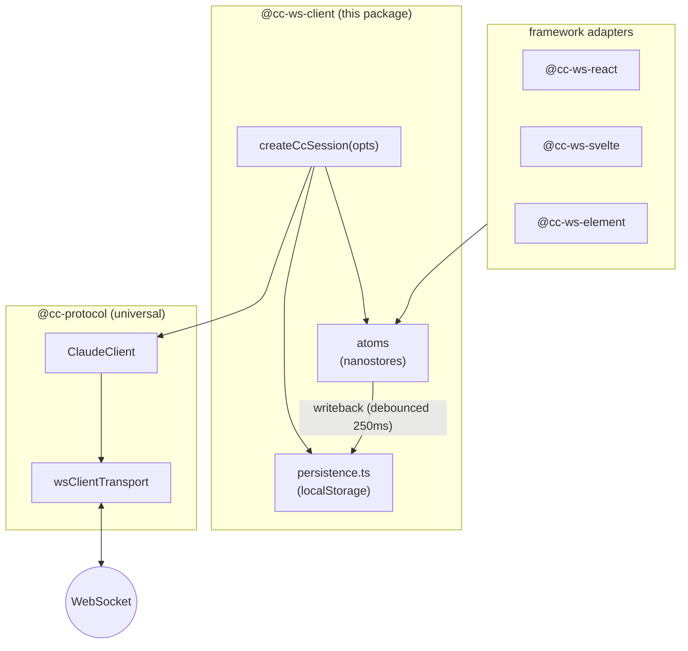

# @somewhatintelligent/cc-ws-client

Reactive nanostores facade over `ClaudeClient` from `@cc-protocol`,
plus localStorage persistence. Thin and web-only by design — the
actual wire-protocol intents + state aggregation live in the universal
[`@somewhatintelligent/cc-protocol`](../protocol). This package's job
is two things:

1. Wrap `ClaudeClient`'s plain callbacks into nanostores atoms so
   downstream framework adapters (`cc-ws-react`, `cc-ws-svelte`,
   `cc-ws-element`) can `useStore` / `$atom` them directly.
2. Persist a useful slice of the session to `localStorage` so a page
   reload lands back on the user's transcript with the resume id
   already in flight.

```ts
import { createCcSession } from "@somewhatintelligent/cc-ws-client";

const session = createCcSession({ url: "wss://example.com/ws" });
session.connect();
await session.sendMessage("Hello");
```

## Architecture



`createCcSession` is the orchestrator: it constructs a `ClaudeClient`,
wires its `onStateChange` callback into a fixed set of nanostores atoms,
installs the persistence writer, and exposes both the raw `client` and
the atoms via a single return object.

## `createCcSession(options)`

```ts
import { createCcSession } from "@somewhatintelligent/cc-ws-client";

const session = createCcSession({
  url: "wss://example.com/ws",
  reconnect: { kind: "exp", baseMs: 250, maxMs: 30_000 },
  args: {
    mode: { kind: "continue" },
    permissionMode: "default",
    effort: "high",
    model: "claude-sonnet-4-6",
    includePartialMessages: true,
    includeHookEvents: true,
  },
  persistence: {
    enabled: true,
    key: "cc-ws-session",
    maxMessages: 200,
  },
  onCanUseTool: async (req) => ({ behavior: "allow", updatedInput: req.input }),
  onTrace: (dir, line) => console.log(`[ws] ${dir}`, line),
});

session.connect();
```

### Options

| Option | Default | What |
|---|---|---|
| `url` | required | WebSocket URL of the bridge. |
| `reconnect` | off | Exponential-backoff policy `{ kind: "exp", baseMs, maxMs?, maxAttempts? }`. |
| `args.mode` | `{kind:"continue"}` if persisted sessionId, else `{kind:"new"}` | `{kind:"new"} \| {kind:"continue"} \| {kind:"resume", sessionId}`. |
| `args.permissionMode` | `"default"` | Initial `--permission-mode`. |
| `args.permissionPromptTool` | `"stdio"` | `--permission-prompt-tool`. |
| `args.includePartialMessages` | `true` | `--include-partial-messages`. |
| `args.includeHookEvents` | `true` | `--include-hook-events`. |
| `args.effort` | (none) | `--effort`. |
| `args.model` | (none) | `--model`. |
| `persistence.enabled` | `true` | Set `false` to disable localStorage writeback. |
| `persistence.key` | `"cc-ws-session"` | localStorage key. |
| `persistence.maxMessages` | `200` | Cap on persisted message-frame count. |
| `persistence.storage` | `globalThis.localStorage` | Override (e.g. for tests or SSR). |
| `onCanUseTool` | (queued) | Low-level callback for `can_use_tool` control_requests. If omitted, requests land in `atoms.pendingPermissions` for UI to resolve via `session.respondToPermission(id, decision)`. |
| `onTrace` | (silent) | Wire trace hook — receives `("in" \| "out", line)` for every WS message. |
| `testTransport` | (none) | Internal test seam: inject your own `Transport` instead of a `wsClientTransport`. |

### Returned shape

```ts
{
  atoms: {
    status, lastError,
    init, messages, activeStreamId, messagesRevision, userMessages,
    activeMode, pendingMode, modeError,
    activeModel, pendingModel, modelError,
    activeEffort, pendingEffort, effortError,
    pendingPermissions, hookEvents, shellEntries, tasks, sessionState,
  },
  client,                          // raw ClaudeClient — escape hatch
  connect, disconnect,
  sendMessage(text),
  sendShellContext(cmd, followUp?),
  sendBashSideChannel(cmd),
  interrupt(),
  endSession(),
  setPermissionMode(mode),
  cyclePermissionMode(),
  setModel(model),
  setEffort(effort),
  setMaxThinkingTokens(n),
  newSession(),
  continueSession(),
  resumeSession(sessionId),
  stopTask(taskId),
  respondToPermission(id, decision),
  fetchFileSuggestions(query),
  dismissShellEntry(id),
}
```

## Atoms

All read-only nanostores `ReadableAtom<T>` unless noted. Subscribe via
`atom.subscribe(cb)`, or use the framework adapters:

| Atom | Type | What |
|---|---|---|
| `status` | `"idle" \| "connecting" \| "open" \| "closed"` | WS lifecycle. |
| `lastError` | `string \| null` | Last connection error. |
| `init` | `InitData` | `{ sessionId, model, cwd, agents, slashCommands, skills }` from `system/init`. |
| `messages` | `MessageEntry[]` | Streaming-bubble timeline, assembled from `assistant` / `stream_event` / `user` frames. |
| `activeStreamId` | `string \| null` | id of the currently-streaming message, or null. |
| `messagesRevision` | `number` | Bumps on save-worthy changes (frame add / clear / hydrate). Persistence subscribes here, not to `messages`, so streaming tokens don't kick the debounce. |
| `userMessages` | `UserMessageEntry[]` | User-side timeline (separate from `messages` for UI ergonomics). |
| `activeMode` | `PermissionMode` | Last confirmed `set_permission_mode`. |
| `pendingMode` | `PermissionMode \| null` | Mode requested but not yet acked. |
| `modeError` | `string \| null` | Auto-clears after 5s. |
| `activeModel` | `string` | Last confirmed `set_model`. |
| `pendingModel` | `string \| null` | Model requested but not yet acked. |
| `modelError` | `string \| null` | Auto-clears after 5s. |
| `activeEffort` | `Effort \| ""` | Current effort tier. |
| `pendingEffort` | `Effort \| null` | Effort requested (effort requires respawn). |
| `effortError` | `string \| null` | Auto-clears after 5s. |
| `pendingPermissions` | `PendingPermission[]` | UI-shape queue of unresolved `can_use_tool` control_requests. |
| `hookEvents` | `HookEntry[]` | `hook_started → hook_progress → hook_response` chains. |
| `shellEntries` | `ShellEntry[]` | `local_command_output` aggregations with rolling output. |
| `tasks` | `TaskEntry[]` | `system/task_*` lifecycle, including sub-agent task routing. |
| `sessionState` | `"idle" \| "running" \| "requires_action"` | Top-level session phase. |

## Persistence

Persisted (debounced 250ms, key defaults to `cc-ws-session`):

```ts
type PersistedShape = {
  sessionId: string | null;
  messages?: MessageEntry[];    // filtered to kind="frame"|"local_user", trimmed to maxMessages
  permissionMode?: PermissionMode;
  model?: string;
  effort?: Effort;
};
```

On `createCcSession`, the loader reads this blob and:

- Sets `initialMode = {kind:"resume", sessionId}` if `sessionId` exists, else `{kind:"continue"}`.
- Calls `client.hydrateMessages(messages)` to restore the timeline.
- Calls `client.seedMode(permissionMode)` / `seedModel(model)` / `seedSessionId(sessionId)` so atoms start with the resumed values *before* `system/init` arrives. (Without seeding `sessionId`, the persistence writer's first debounced save would flush the in-memory `null` over the persisted id — wiping the resume target out of localStorage.)

The writer subscribes to the *atoms*, so a save fires whenever any of
{sessionId, messagesRevision, activeMode, activeModel, activeEffort}
changes. Streaming tokens don't trigger saves (they bump `messages` but
not `messagesRevision`).

To disable persistence:

```ts
createCcSession({ url, persistence: { enabled: false } });
// or
createCcSession({ url, persistence: false });
```

## `createReactiveClient` — minimal alternative

For consumers that don't want the full `CcAtoms` surface (logging
clients, headless tools, custom UIs):

```ts
import { createReactiveClient } from "@somewhatintelligent/cc-ws-client";

const { client, state } = createReactiveClient({
  url: "wss://example.com/ws",
  reconnect: { kind: "exp", baseMs: 250 },
});

state.subscribe((snap) => console.log(snap));   // ClientState
await client.sendUserMessage("hi");
```

Exposes the raw `ClaudeClient` and a single `state` atom holding the
full `ClientState` snapshot — no per-field atoms, no persistence, no
mode/model/effort error helpers. Use this when you want the full
state shape but not the full UI ergonomics.

## Subpath exports

```
@somewhatintelligent/cc-ws-client
  ./                       createCcSession + createReactiveClient + all atom types
  ./protocol               type re-exports from @cc-protocol
  ./modes                  PermissionMode / Effort helpers
  ./reactive               createCcSession + createReactiveClient (same as ./)
```

## Bridge

You need a cc-ws bridge running somewhere reachable from the browser —
see [`@somewhatintelligent/cc-ws-server`](../server). For local dev,
`apps/web`'s `dev` script runs both concurrently:

```sh
bun --filter './apps/web' dev
```

## Framework adapters

| Adapter | When to use |
|---|---|
| [`@cc-ws-react`](../react) | React 18/19 + the `useCcSession(session)` hook. |
| [`@cc-ws-svelte`](../svelte) | Svelte 5 + typed `getCcSession()` context. |
| [`@cc-ws-element`](../element) | Drop-in `<cc-ws-chat>` custom element — no framework wiring needed. |
