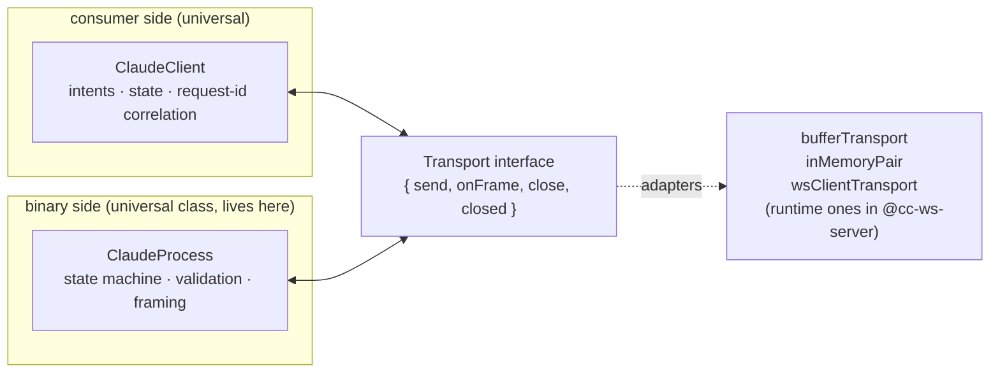
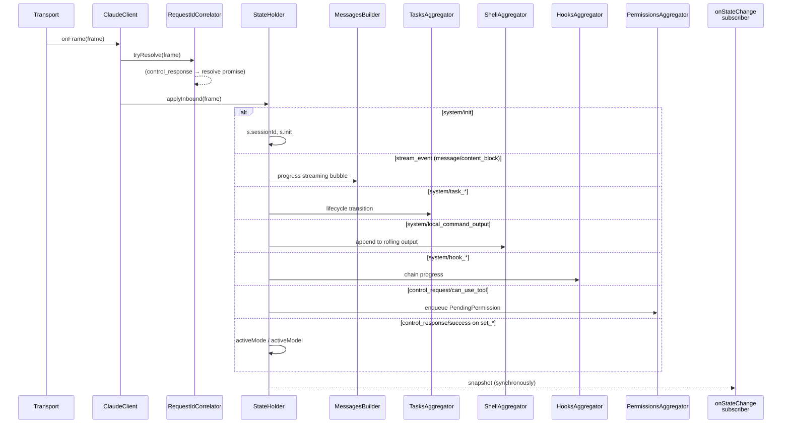

# @somewhatintelligent/cc-protocol

Universal, browser-safe protocol layer for the Claude Code stream-json
wire format. Schemas + types + state aggregation + transport interface —
zero references to `Bun.*` or `node:*` anywhere in `src/`.

The wire-format definitions are *generated* from a pinned Anthropic
binary (currently `2.1.139`) — never hand-written, never copied from
leaked source. See [`../../codegen/README.md`](../../codegen/README.md)
for the pipeline.

## Three-piece architecture



Both principals are universal — they wrap *any* `Transport`. The
runtime-specific adapters (`spawnTransport`, `stdioTransport`,
`wsServerTransport`) that need `Bun.spawn` live in `@cc-ws-server` so
this package stays browser-safe.

## Schemas + types

```ts
// Types-only (browser, client-side narrowing) — `import type` strips the
// arktype runtime; consumers ship 0 KB of validator code.
import type {
  SystemInit,
  ControlResponseMessage,
  PermissionMode,
} from "@somewhatintelligent/cc-protocol";

function handle(frame: SystemInit) {
  if (frame.subtype === "init") {
    console.log(frame.session_id);
  }
}
```

```ts
// Runtime validation (server, integration tests).
import { ControlResponseMessage } from "@somewhatintelligent/cc-protocol";

const frame: unknown = JSON.parse(line);
if (ControlResponseMessage.allows(frame)) {
  // frame is now typed as ControlResponseMessage
}
```

```ts
// O(1) discriminator lookup — ClaudeProcess uses this on its hot path.
import { inboundBySubtype, inboundByType } from "@somewhatintelligent/cc-protocol";

const schema = inboundBySubtype[frame.subtype] ?? inboundByType[frame.type];
if (schema && !schema.allows(frame)) {
  // structural mismatch — log/drop
}
```

## `ClaudeClient` — consumer-side

Wraps any `Transport`. Translates high-level intents into wire frames,
correlates `request_id`s back to promises, and aggregates inbound
frames into a rich `ClientState`. No reactivity dep — exposes plain
callbacks + `getSnapshot()`. The web facade (`@cc-ws-client`'s
`reactive.ts`) is what wraps this into nanostores atoms.

```ts
import { ClaudeClient } from "@somewhatintelligent/cc-protocol/client";
import { wsClientTransport } from "@somewhatintelligent/cc-protocol/transport/ws-client";

const transport = wsClientTransport("wss://my-server/ws", {
  reconnect: { kind: "exp", baseMs: 250, maxMs: 30_000 },
});

const client = new ClaudeClient(transport, {
  onCanUseTool: async (req) => {
    // Optional: raw low-level callback for tool-permission requests.
    // Bypasses the higher-level pendingPermissions queue. If omitted, the
    // queue is populated and consumers respond via
    // `client.respondToPermission(id, decision)`.
    return { behavior: "allow", updatedInput: undefined };
  },
});

// Reactive surface — sync snapshot read + change subscription.
client.onStateChange((snap) => {
  console.log("session", snap.sessionId, "msgs", snap.messages.length);
});

await client.setPermissionMode("plan");
await client.setModel("claude-sonnet-4-6");
await client.sendUserMessage("Hello.");
```

### `ClientState` — what the client aggregates

```ts
interface ClientState {
  // Session
  sessionId: string | null;
  sessionState: "idle" | "running" | "requires_action";
  init: InitData;   // cwd, model, agents, slashCommands, skills

  // Mode (set_permission_mode round-trip)
  activeMode: string | null;
  pendingMode: string | null;
  modeError: string | null;
  lastPermissionMode: string | null;

  // Model (set_model round-trip)
  activeModel: string | null;
  pendingModel: string | null;
  modelError: string | null;
  lastModel: string | null;

  // Rich aggregations
  messages: MessageEntry[];               // streaming-bubble timeline
  activeStreamId: string | null;          // currently-streaming message id
  messagesRevision: number;               // bumps on save-worthy changes
  userMessages: UserMessageEntry[];       // user-side timeline
  tasks: TaskEntry[];                     // sub-agent + workflow tasks
  shellEntries: ShellEntry[];             // local_command_output aggregations
  hookEvents: HookEntry[];                // hook_started → progress → response
  pendingPermissions: PendingPermission[]; // can_use_tool UI queue
}
```

### Intent methods

Every intent returns a typed promise resolved by the matching
`control_response/success`:

| Method | Wire subtype |
|---|---|
| `setPermissionMode(mode)` | `set_permission_mode` |
| `setModel(model)` | `set_model` |
| `setMaxThinkingTokens(n)` | `set_max_thinking_tokens` |
| `interrupt()` | `interrupt` |
| `getSettings()` | `get_settings` |
| `getContextUsage()` | `get_context_usage` |
| `getSessionCost()` | `get_session_cost` |
| `getBinaryVersion()` | `get_binary_version` |
| `fileSuggestions(query)` | `file_suggestions` |
| `mcpStatus()` | `mcp_status` |
| `reloadPlugins()` | `reload_plugins` |
| `applyFlagSettings()` | `apply_flag_settings` |
| `seedReadState()` | `seed_read_state` |
| `stopTask(taskId)` | `stop_task` |
| `endSession()` | `end_session` |

Plus non-control intents:
- `sendUserMessage(text)` — outbound user frame
- `bashCommand(command)` — bash side-channel (handled by `cc-ws-server`)
- `respondToPermission(requestId, decision)` — answer a pending `can_use_tool`
- `sendShellContext(command, followUp?)` — synthetic shell tag for context
- `sendBashSideChannel(command)` — alias

And lifecycle helpers:
- `hydrateMessages(entries)` / `seedMode(mode)` / `seedModel(model)` / `seedSessionId(id)` — persistence-restore seeds
- `abortAllIntents(reason)` — reject all in-flight intents (used on disconnect / respawn)
- `clearPermissionsQueue()` — drop pending permissions
- `resetTimeline()` — reset messages / tasks / shell / hooks on respawn-with-reset
- `dispose()` — tear down

### State aggregation flow



### Respawn — caller-managed

`ClaudeClient` is single-shot per transport. To resume / switch sessions:

```ts
await client.dispose();
const next = new ClaudeClient(freshTransport);
```

`@cc-ws-client/reactive.ts` does this internally on `+new` / resume —
it disposes the underlying transport, sends `_local:respawn` to the
server with new args, then constructs a fresh client.

## `ClaudeProcess` — binary-side

Universal class. Wraps any `Transport` with the protocol state machine
+ validation. **Does not spawn anything itself** — pair with
`spawnTransport` from `@cc-ws-server` (or any other Transport you build).

```ts
import { ClaudeProcess } from "@somewhatintelligent/cc-protocol/process";
import { spawnTransport } from "@somewhatintelligent/cc-ws-server/transport/spawn";

const childT = spawnTransport({ args: ["--continue"] });
const proc = new ClaudeProcess(childT, { validation: "discriminator" });

await proc.start();                            // sends initialize, awaits ack, warms validators
proc.onFrame((f) => /* ... */);                // per-tier-validated frames
proc.onMetrics((snap) => console.log(snap));   // periodic { framesValidated, validationMicrosP50, P99 }
await proc.send(someFrame);
await proc.end();                              // sends end_session, awaits ack
```

To respawn: dispose + construct a new one with a fresh transport.

```ts
await proc.end();
const next = new ClaudeProcess(spawnTransport({ args: ["--continue"] }));
await next.start();
```

### Validation tiers

| Mode | When to use | Per-frame work |
|---|---|---|
| `off` | Production hot path, well-burned-in code. | None. Pure passthrough. |
| `discriminator` (default) | Production safe path. | Read `type` / `subtype`, look up schema in `dispatch.ts`, confirm the literal exists. O(1) per frame, no allocation. |
| `strict` | Tests, development, schema burn-in. | Full arktype `.allows()` per frame. |

`stream_event` frames bypass field validation regardless of mode unless
`validateStreamEvents: true` — they're the highest-rate frame type
(thousands per turn during streaming) and walking their `partial_json`
field on every delta would cost more than the validation buys.

## Testing — `inMemoryPair`

Wire `ClaudeClient ↔ ClaudeProcess` together with zero IO, zero binary,
zero network:

```ts
import { inMemoryPair } from "@somewhatintelligent/cc-protocol/transport/in-memory-pair";
import { ClaudeClient } from "@somewhatintelligent/cc-protocol/client";
import { ClaudeProcess } from "@somewhatintelligent/cc-protocol/process";

const [a, b] = inMemoryPair();
const client = new ClaudeClient(a);
const proc = new ClaudeProcess(b, { validation: "strict" });

// Drive a committed fixture through b's onFrame side to simulate the binary;
// assert client.getSnapshot() matches the expected state.
```

This is how `packages/protocol/__tests__/e2e-in-memory.test.ts` does the
full Client ↔ Process round-trip — see that file for the harness.

## Subpath exports

```
@somewhatintelligent/cc-protocol
  ./                                schemas + types + dispatch + version re-exports
  ./schemas                         alias of ./
  ./version                         ACTIVE_VERSION + binary metadata
  ./process                         ClaudeProcess + framing helpers
  ./client                          ClaudeClient + state types
  ./transport                       Transport interface + helpers
  ./transport/buffer                bufferTransport()
  ./transport/in-memory-pair        inMemoryPair()
  ./transport/ws-client             wsClientTransport(url, opts?)
```

Runtime-specific adapters (`stdio`, `ws-server`, `spawn`) live in
[`@somewhatintelligent/cc-ws-server`](../server) — they pull in
`Bun.spawn` / `Bun.ServerWebSocket` and would defeat the browser-safe
guarantee here.

## Browser-safety guarantee

Enforced by a CI grep gate (in `codegen/checkpoint.ts`):

```sh
grep -rE "Bun\.|node:|require\(\"node|process\.spawn" packages/protocol/src/
# must return 0 matches
```

If you add a transport that needs Node/Bun, put it in `@cc-ws-server`
(or any new Bun-only package) and depend on `@cc-protocol`'s
universal pieces.

## Regen workflow

The schemas are *generated*, not hand-written. To bump to a new Claude
binary, invoke the **`regen-protocol`** skill at
[`.claude/skills/regen-protocol/SKILL.md`](../../.claude/skills/regen-protocol/SKILL.md).
Triggers: "bump claude protocol", "regen claude schemas", "claude
binary updated". The skill walks the 13-step procedure end-to-end and
lands at a green `bun codegen/checkpoint.ts`.

See [`codegen/README.md`](../../codegen/README.md) for the underlying
pipeline details.
