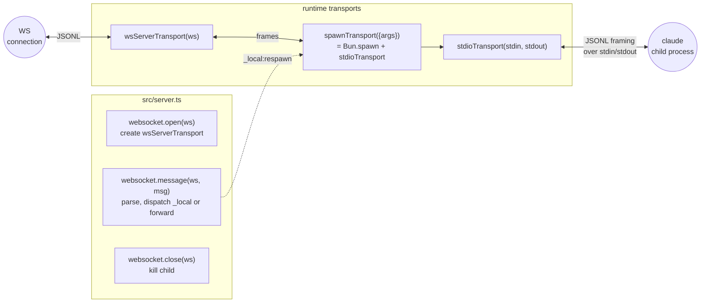

# @somewhatintelligent/cc-ws-server

Bun-based runtime for fronting a Claude Code child process. Three
concerns:

1. **WebSocket bridge** (`src/server.ts`) — for each WS connection,
   spawns a `claude` child via `spawnTransport`, bridges frames to the
   browser via `wsServerTransport`, supports `_local:respawn` for
   new/continue/resume.
2. **Runtime transports** — Node/Bun-specific adapters that implement
   `@cc-protocol/transport.Transport`: `stdio`, `ws-server`, `spawn`.
   Pure additions on top of `@cc-protocol` — they expose runtime-only
   capabilities (`Bun.spawn`, `Bun.ServerWebSocket`) that the universal
   package can't ship.
3. **Validation host** — pair `ClaudeProcess` (from `@cc-protocol`)
   with `spawnTransport` to validate inbound frames against the pinned
   schemas. Optional but recommended for production.

## Architecture



## 1. The WebSocket bridge

`bun src/server.ts` (or the installed `cc-ws-server` bin) starts a
bare-bones WS-only Bun server on `PORT` (default 3000) at `/ws`:

```sh
bun add -g @somewhatintelligent/cc-ws-server
PORT=9999 cc-ws-server
```

Or embed in your own `Bun.serve`:

```ts
import { websocket, createWsData } from "@somewhatintelligent/cc-ws-server";

Bun.serve({
  fetch(req, srv) {
    const url = new URL(req.url);
    if (url.pathname === "/ws") {
      if (srv.upgrade(req, { data: createWsData() })) return;
      return new Response("expected ws upgrade", { status: 426 });
    }
    // your own routes...
  },
  websocket,
});
```

Per-connection lifecycle:

1. `open` — `ws.data.wsT = wsServerTransport(ws)`. **No child spawned yet** — the bridge awaits the client's initial `_local:respawn` to know which args to use (`--continue` vs `--resume <id>` vs flags).
2. `message` — if `_local:respawn`, tear down any previous child + spawn a fresh one with the requested args; reply with `_local:respawnResult { ok, requestId }`. Otherwise forward verbatim to the current child's stdin.
3. Inbound from child stdio → forwarded to the WS verbatim.
4. `close` — kill the child.

The bridge is a passthrough by design: the consumer (browser) owns the
protocol state machine (`initialize` / `set_permission_mode` /
`end_session` / …). The server does not instantiate `ClaudeProcess` in
the bridge path because that would race the consumer's own
`initialize`.

## 2. `ClaudeProcess` with `spawnTransport` (host pattern)

For headless / CLI / non-WS hosts where the consumer is on the *same
process* as the binary (or you want server-side validation), pair
`ClaudeProcess` from `@cc-protocol` with `spawnTransport` from this
package:

```ts
import { ClaudeProcess } from "@somewhatintelligent/cc-protocol/process";
import { spawnTransport } from "@somewhatintelligent/cc-ws-server/transport/spawn";

const childT = spawnTransport({
  args: ["--continue"],
  env: process.env,
});
const proc = new ClaudeProcess(childT, { validation: "discriminator" });

await proc.start();                                       // sends initialize, awaits ack, warms validators
proc.onFrame((f) => /* ... */);                           // per-tier validated
proc.onMetrics((snap) => console.log("metrics", snap));   // periodic { framesValidated, P50, P99 }
await proc.send(outbound);
await proc.end();                                         // sends end_session, awaits ack, closes stdio
```

Respawn: dispose + recreate.

```ts
await proc.end();
const next = new ClaudeProcess(spawnTransport({ args: ["--continue"] }));
await next.start();
```

## 3. Runtime transports overview

| Subpath | What it does |
|---|---|
| [`./transport/stdio`](src/transport/stdio.ts) | `stdioTransport({ stdin, stdout })` — JSONL framing over arbitrary Web Streams / `FileSink` pair. Used by `spawnTransport` internally; also exposed for hosts that want a Transport over an existing piped stdio pair. |
| [`./transport/ws-server`](src/transport/ws-server.ts) | `wsServerTransport(ws: Bun.ServerWebSocket)` — bridges a Bun WS into a `Transport`. Call `t.deliver(msg)` from your `websocket.message` handler; `t.shutdown()` from `close`. |
| [`./transport/spawn`](src/transport/spawn.ts) | `spawnTransport({ args, env? })` — `Bun.spawn`s the claude binary with the canonical stream-json flags, wires stdio internally. Returns `Transport & { pid, exited: Promise<number>, kill() }`. |

For the universal pieces (`ClaudeClient`, `bufferTransport`,
`inMemoryPair`, `wsClientTransport`) see
[`@somewhatintelligent/cc-protocol`](../protocol).

## Designed for

A Cloudflare Sandbox container; the worker proxies WS upgrades to
`127.0.0.1:$PORT/ws`. Also works fine as a local dev bridge — see
`apps/web` for the canonical setup (`bun --hot ../../packages/server/src/server.ts`
concurrent with `vite`).

## Tests

```sh
# Transport contract tests (no binary needed)
bun test packages/server/__tests__/transport-stdio.test.ts
bun test packages/server/__tests__/transport-ws-server.test.ts
bun test packages/server/__tests__/transport-spawn.test.ts   # spawns a `cat`-like helper

# Opt-in: real binary E2E
CC_PROTOCOL_LIVE_BINARY=1 bun test packages/server/__tests__/live.test.ts
```

## Notes

- The bridge has **no authentication**. Put it behind something (Cloudflare access, an authenticated proxy, an SSO mesh) before exposing it on a public address.
- One WS = one `claude` child = one session. No multiplexing; `_local:respawn` swaps the child but doesn't keep N concurrent.
- Relies on the host already being OAuth-authed at `~/.claude/.credentials.json` (or `ANTHROPIC_API_KEY` exported).
